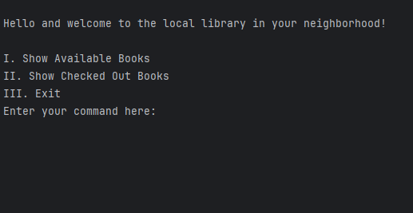
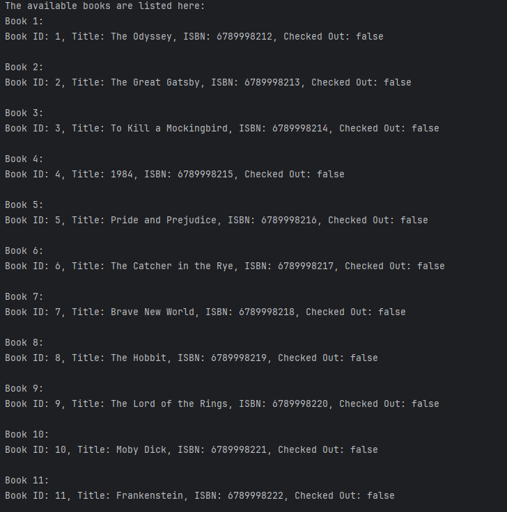
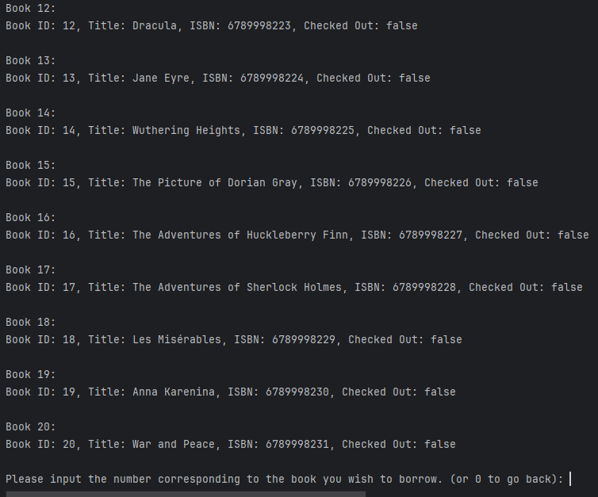
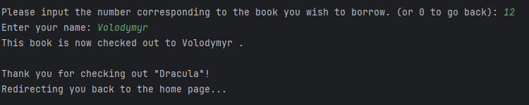
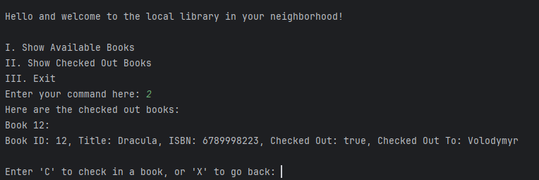
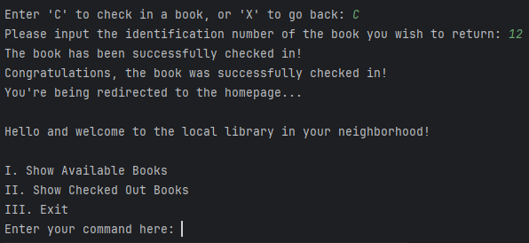

# Neighborhood-Library

Hello and welcome to the Neighborhood Library project application! This project serves as a demonstration of the skills acquired thus far by crafting a free service resembling system for a local library.

Upon launching the application, users encounter a welcome screen followed by a main menu offering various choices. To make a selection, users simply input the corresponding number or letter for the desired option. For a more detailed visual representation, please refer to the screenshot section provided in this README.

# Screenshots

In the provided screenshot, you'll find the initial welcome screen along with the available choices for the user.

In the image provided, you'll find the display for selecting option 1. It shows a lineup of books ready for "borrowing." Beneath this selection, additional choices are presented. Among them, you have the option to input the ID number of a desired book for borrowing. Alternatively, entering 0 will navigate you back to the Main Menu.

Image below shows you that you can check out a book, by entering the ID number or if you want to go back to the home screen you need enter 0.

In the provided screenshot, selecting Book 12 initiates a prompt for your name. Upon entering it correctly, a success message appears, and you're redirected to the home page.

Upon selecting option 2 from the main menu, you're presented with a list of checked-out books and their respective borrowers. Beneath this list, additional options allow you to return to the home screen or check in any of the borrowed books. Let's proceed by returning the borrowed book.

Upon selecting option "C," you'll be asked to specify the book for return (book ID 12). Once you've done that correctly, a success message will appear, and you'll be returned to the main screen.

The application appears to be designed for straightforward usage, as evidenced by the clear instructions and accompanying screenshots. Should you have any questions or feedback, please don't hesitate to reach out. Your satisfaction is important, and I'm here to assist you every step of the way!
